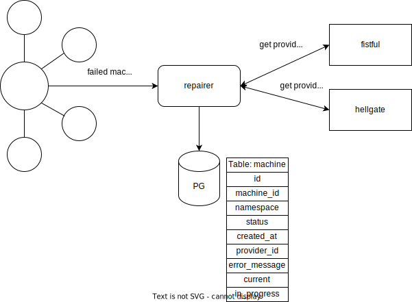
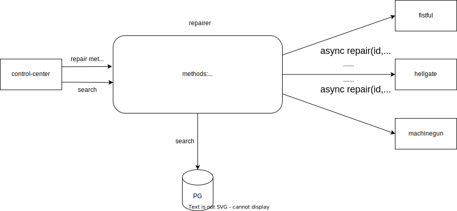

# repairer

## Описание
Сервис для восстановления упавших машин. 
Читает топик кафки с упавшими машинами, сохраняет их базу данных. 
Имеет три ручки для  массового восстановления машин: 
инвойсов, выплат(withdrawal_session) и восстановление машин непосредственно в машингане.
Эти ручки редиректят в соответствующие вызовы **repair** на интерфейсах **hellgate**, **fistful** или **machinegun**.
Вызовы выполняются массово и в асинхронном режиме. Для запущенных к восстановлению машин предусмотрен
специальный статус **in_progress**, означащий, что машина в процессе восстановления. 
Финальным статусом является **repaired**, или же машина может снова вернуться в статус **failed** 
в случае неуспешного восстановления. 
Имеет ручку поиска машин (search).

## Протокол 

Сервис имплементирует протокол https://github.com/valitydev/repairer-proto
По этому протоколу сервис вызывается админкой **control-center**, в которой реализован визуальный интерфейс для отображения упавших машин и кнопки для их восстановления. 

## Чтение из кафки и сохранение в базу данных postgres

## Восстановление машин

